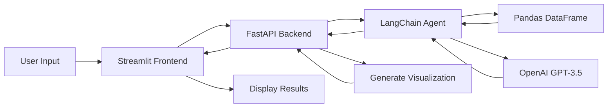

# Titanic Dataset Chat Agent 🚢

A friendly chatbot that analyzes the famous Titanic dataset using natural language queries. Built with FastAPI, LangChain, and Streamlit.


## Features ✨

- 🤖 Natural language query processing using LangChain and OpenAI
- 📊 Automatic visualization generation (histograms, bar charts, pie charts)
- 💬 Clean, interactive chat interface
- 🎯 Accurate data analysis and insights
- 🚀 Easy deployment to Streamlit Cloud

## Technology Stack 🛠️

- **Backend**: FastAPI
- **AI Agent**: LangChain with OpenAI GPT-3.5
- **Frontend**: Streamlit
- **Visualizations**: Plotly
- **Data Processing**: Pandas

## Quick Start 🚀

### Prerequisites

- Python 3.8 or higher
- OpenAI API key ([Get one here](https://platform.openai.com/api-keys))

### Installation

1. **Clone the repository**

```bash
git clone <your-repo-url>
cd TitanicChatAgent
```

2. **Install dependencies**

```bash
pip install -r requirements.txt
```

3. **Set up environment variables**

Create a `.env` file in the root directory:

```bash
OPENAI_API_KEY=sk-your-api-key-here
API_URL=http://localhost:8000
```

4. **Run the application**

**Option A: Using the startup script (Windows)**

```powershell
powershell -ExecutionPolicy Bypass -File start.ps1
```

**Option B: Manual start**

Terminal 1 (Backend):

```bash
cd backend
python -m uvicorn main:app --reload --host 0.0.0.0 --port 8000
```

Terminal 2 (Frontend):

```bash
cd frontend
streamlit run app.py
```

5. **Open your browser**

The app will automatically open at `http://localhost:8501`

## Example Questions 🤔

Try asking the chatbot:

- ✅ "What percentage of passengers were male on the Titanic?"
- ✅ "Show me a histogram of passenger ages"
- ✅ "What was the average ticket fare?"
- ✅ "How many passengers embarked from each port?"
- ✅ "What was the survival rate?"
- ✅ "Show me the distribution of passenger classes"
- ✅ "How many children were on board?"
- ✅ "What was the average age of survivors vs non-survivors?"
- ✅ "Which passenger class had the highest survival rate?"
- ✅ "What was the most expensive ticket?"

## Deployment to Streamlit Cloud ☁️

### Backend Deployment (Choose One)

#### Option 1: Deploy to Render

1. Create account at [render.com](https://render.com)
2. Create a new Web Service
3. Connect your GitHub repository
4. Set build command: `pip install -r requirements.txt`
5. Set start command: `cd backend && uvicorn main:app --host 0.0.0.0 --port $PORT`
6. Add environment variable: `OPENAI_API_KEY`
7. Deploy!

#### Option 2: Deploy to Railway

1. Create account at [railway.app](https://railway.app)
2. Click "New Project" → "Deploy from GitHub repo"
3. Select your repository
4. Add environment variable: `OPENAI_API_KEY`
5. Railway will auto-detect and deploy!

### Frontend Deployment (Streamlit Cloud)

1. Push your code to GitHub
2. Go to [share.streamlit.io](https://share.streamlit.io)
3. Click "New app"
4. Connect your GitHub repository
5. Set main file path: `frontend/app.py`
6. Click "Advanced settings" and add secrets:

```toml
OPENAI_API_KEY = "sk-your-api-key-here"
API_URL = "https://your-backend-url.com"
```

7. Click "Deploy"!

Your app will be live at: `https://your-app-name.streamlit.app`

## Project Structure 📁

```
TitanicChatAgent/
├── backend/
│   └── main.py                 # FastAPI backend with LangChain agent
├── frontend/
│   └── app.py                  # Streamlit frontend
├── data/
│   └── titanic.csv            # Titanic dataset (891 passengers)
├── .streamlit/
│   ├── config.toml            # Streamlit configuration
│   └── secrets.toml.example   # Secrets template
├── requirements.txt           # Python dependencies
├── .env.example              # Environment variables template
├── .gitignore                # Git ignore file
├── start.ps1                 # Windows startup script
├── start.sh                  # Linux/Mac startup script
└── README.md                 # This file
```

## How It Works 🔍



1. **User Input**: User asks a question in natural language
2. **API Request**: Streamlit frontend sends the question to FastAPI backend
3. **LangChain Agent**: The agent analyzes the question using OpenAI GPT-3.5
4. **Data Analysis**: Agent queries the Pandas DataFrame
5. **Response Generation**: Agent generates a text answer
6. **Visualization**: Backend determines if visualization is needed and creates config
7. **Display**: Streamlit renders the answer and visualization

## Configuration ⚙️

### Environment Variables

| Variable         | Description         | Required | Default                 |
| ---------------- | ------------------- | -------- | ----------------------- |
| `OPENAI_API_KEY` | Your OpenAI API key | Yes      | -                       |
| `API_URL`        | Backend API URL     | No       | `http://localhost:8000` |

### Streamlit Configuration

Edit `.streamlit/config.toml` to customize the app appearance:

```toml
[theme]
primaryColor = "#1E3A8A"
backgroundColor = "#FFFFFF"
secondaryBackgroundColor = "#F3F4F6"
textColor = "#1F2937"
font = "sans serif"
```

## Troubleshooting 🔧

### "Unable to connect to API"

- ✅ Ensure backend is running on port 8000
- ✅ Check `API_URL` environment variable
- ✅ Verify firewall settings

### "OpenAI API Error"

- ✅ Verify your `OPENAI_API_KEY` is valid
- ✅ Check OpenAI account has credits
- ✅ Ensure API key is in `.env` file

### Import Errors

- ✅ Install dependencies: `pip install -r requirements.txt`
- ✅ Use a virtual environment
- ✅ Check Python version (3.8+)

### Dataset Issues

- ✅ Run `python download_dataset.py` to re-download
- ✅ Ensure `data/titanic.csv` exists
- ✅ Check file has correct format

## API Documentation 📚

When the backend is running, visit:

- Swagger UI: `http://localhost:8000/docs`
- ReDoc: `http://localhost:8000/redoc`

### Endpoints

#### `GET /`

Health check endpoint

```json
{ "message": "Titanic Chat Agent API is running" }
```

#### `GET /dataset/info`

Get dataset information

```json
{
  "total_passengers": 891,
  "columns": ["PassengerId", "Survived", "Pclass", ...],
  "shape": [891, 15],
  "sample": [...]
}
```

#### `POST /query`

Query the dataset

```json
{
  "question": "What percentage of passengers were male?"
}
```

Response:

```json
{
  "answer": "Approximately 64.76% of passengers were male.",
  "visualization": {
    "type": "bar",
    "data": { "male": 577, "female": 314 },
    "title": "Gender Distribution"
  }
}
```

## Dataset Information 📊

The Titanic dataset contains information about 891 passengers:

| Column      | Description                                                          |
| ----------- | -------------------------------------------------------------------- |
| PassengerId | Unique identifier                                                    |
| Survived    | Survival (0 = No, 1 = Yes)                                           |
| Pclass      | Ticket class (1 = 1st, 2 = 2nd, 3 = 3rd)                             |
| Name        | Passenger name                                                       |
| Sex         | Gender                                                               |
| Age         | Age in years                                                         |
| SibSp       | # of siblings/spouses aboard                                         |
| Parch       | # of parents/children aboard                                         |
| Ticket      | Ticket number                                                        |
| Fare        | Passenger fare                                                       |
| Cabin       | Cabin number                                                         |
| Embarked    | Port of embarkation (C = Cherbourg, Q = Queenstown, S = Southampton) |

## Development 👨‍💻

### Adding New Visualizations

Edit `generate_visualization_config()` in [backend/main.py](backend/main.py):

```python
if "your_keyword" in question:
    return {
        "type": "your_viz_type",
        "data": your_data,
        "title": "Your Title"
    }
```

### Customizing the Agent

Modify agent configuration in [backend/main.py](backend/main.py):

```python
agent = create_pandas_dataframe_agent(
    llm,
    df,
    verbose=True,
    agent_type="openai-functions",
    max_iterations=5,  # Limit iterations
    allow_dangerous_code=True
)
```

### Testing

```bash
# Test backend
cd backend
pytest

# Test frontend
cd frontend
streamlit run app.py
```

## Security Notes 🔒

- ⚠️ Never commit `.env` file or expose API keys
- ⚠️ `allow_dangerous_code=True` enables code execution - use cautiously
- ✅ Add rate limiting for production deployments
- ✅ Use environment variables for sensitive data
- ✅ Enable CORS only for trusted domains in production

## Performance Tips 🚀

- Use caching for repeated queries: `@st.cache_data`
- Limit agent iterations to prevent slow responses
- Deploy backend and frontend in the same region
- Use connection pooling for database queries

## Contributing 🤝

Contributions are welcome! Please:

1. Fork the repository
2. Create a feature branch
3. Make your changes
4. Submit a pull request

## License 📄

This project is licensed under the MIT License.

## Acknowledgments 🙏

- Titanic dataset from [Kaggle](https://www.kaggle.com/competitions/titanic/data)
- Built with [LangChain](https://langchain.com/), [FastAPI](https://fastapi.tiangolo.com/), and [Streamlit](https://streamlit.io/)
- Powered by [OpenAI GPT-3.5](https://openai.com/)

## Support 💬

If you have questions or need help:

- 📧 Email: your-email@example.com
- 🐛 Issues: [GitHub Issues](https://github.com/your-repo/issues)
- 💬 Discussions: [GitHub Discussions](https://github.com/your-repo/discussions)

## Roadmap 🗺️

- [ ] Add support for multiple datasets
- [ ] Implement user authentication
- [ ] Add more visualization types
- [ ] Support for GPT-4
- [ ] Add export functionality for reports
- [ ] Implement caching for faster responses
- [ ] Add unit tests
- [ ] Multi-language support

---

**Made with ❤️ for the Titanic Dataset Chat Agent Assignment**

⭐ Star this repository if you find it helpful!
